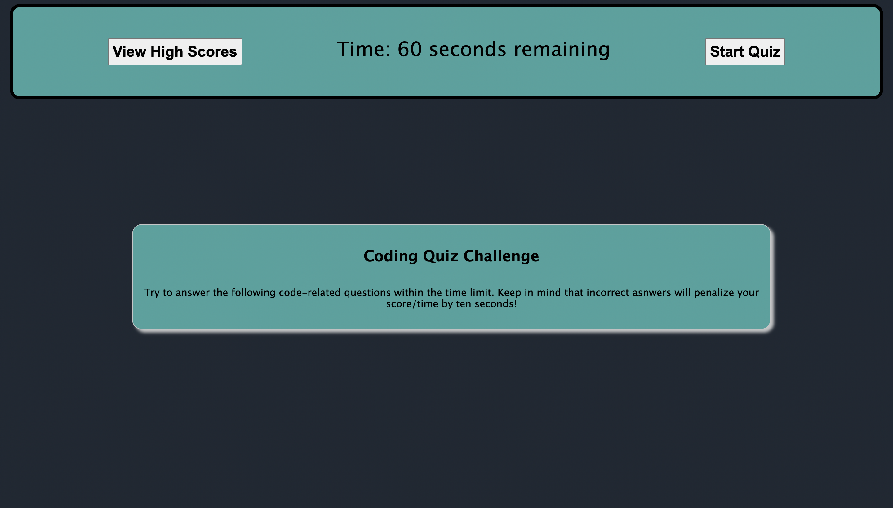

# Homework04
## Web APIs: Code Quiz

This online quiz was developed using HTML, CSS, and vanilla Javascript. There was a base structure put together with the index.html. From there, javascript was used to manipulate the DOM by adding and removing classes, and through event listeners on various buttons. This allows for the user to start the quiz and timer, cycle through questions, and submit their score. 

Try is out! 

